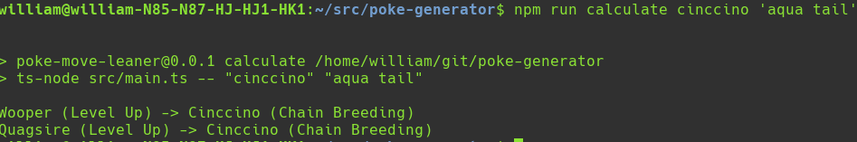

# poke-move-learner

Calculate how a given pokemon (currently only in gen8) can learn a given move.

## Usage

Clone the repository, run `npm i` to install the dependencies and then simply run `npm run calculate ${pokemonName} ${moveName}` to see a path for getting the move. If either the pokemon or the move name contains whitespace it will need to be wrapped in single quotes.

Example:

